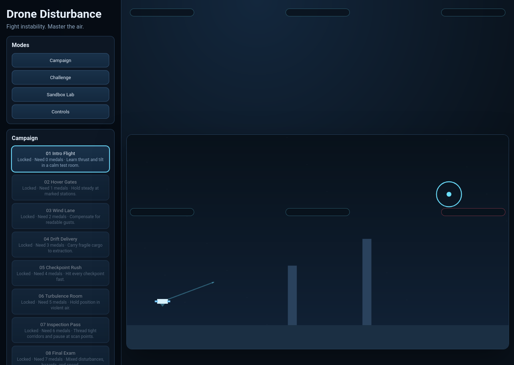

# Drone Disturbance

## Project Documentation

Drone Disturbance is a browser-based 2D drone flying game focused on unstable flight, environmental hazards, and control mastery.

- Playable modes: Campaign, Challenge, Sandbox Lab, and Controls/Tuning
- Tech stack: HTML, CSS, and JavaScript
- Main app entry: `index.html`

## Application Screenshot

Current game interface showing the sidebar, HUD, and live gameplay canvas.

## Implemented Features

### Core Flight Model
Responsive drone movement with thrust, tilt, momentum, gravity, drag, and battery behavior.

### Disturbance System
Dynamic wind, turbulence, and payload imbalance create changing flight conditions.

### Hazards and Fail States
Collisions, danger zones, no-fly areas, and payload damage produce readable mission failures.

### Mission Objectives
Reach targets, hold positions, pass checkpoints, inspect points, and deliver payloads.

### Campaign Progression
Structured level unlocks, medal goals, and persistent progress support long-term play.

### Assists and Tuning
Recommended presets plus stability and agility sliders make the game accessible and customizable.

### HUD and Telemetry
Live objective, timer, score, status, warning, battery, and optional telemetry displays.

### Input and Rebinding
Keyboard and gamepad support with configurable action bindings for fast retries.

### Tutorials and Onboarding
Intro levels and plain-language prompts teach movement, hovering, and disturbance response.

### Challenge and Sandbox Modes
Replayable score-focused challenges and a free-fly lab for testing tuning and disturbances.

### MVP Level Pack
Multiple handcrafted levels across lab, rooftop, canyon, factory, and storm themes.

### Audio and Visual Feedback
Motor and wind cues, warnings, and readable effects improve clarity during high-pressure flying.

## Additional Documentation

- Product documentation: `drone-disturbance-product-documentation.md`
- HTML documentation: `docs/documentation.html`
- Implemented issue specs: `issues-implemented/README.md`
